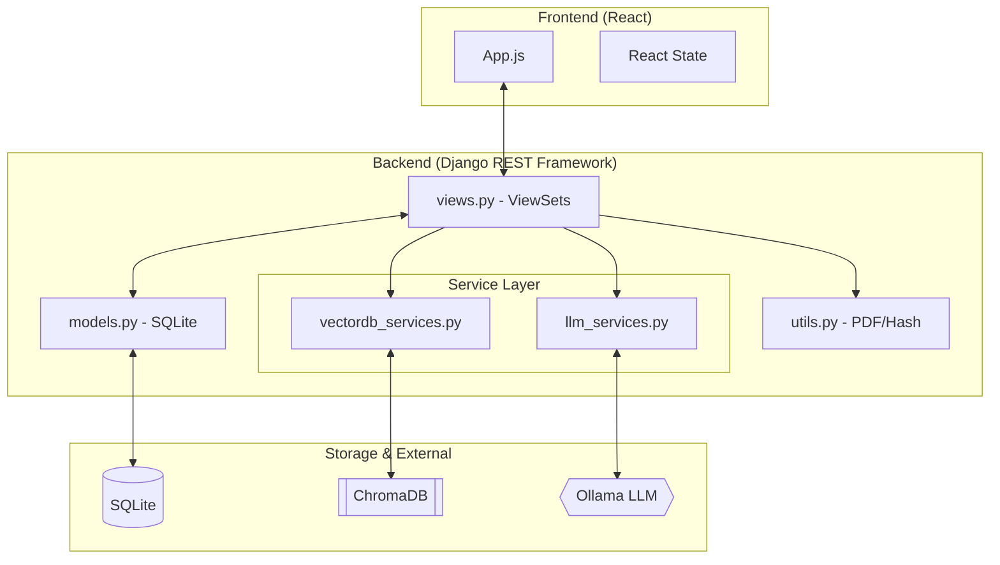
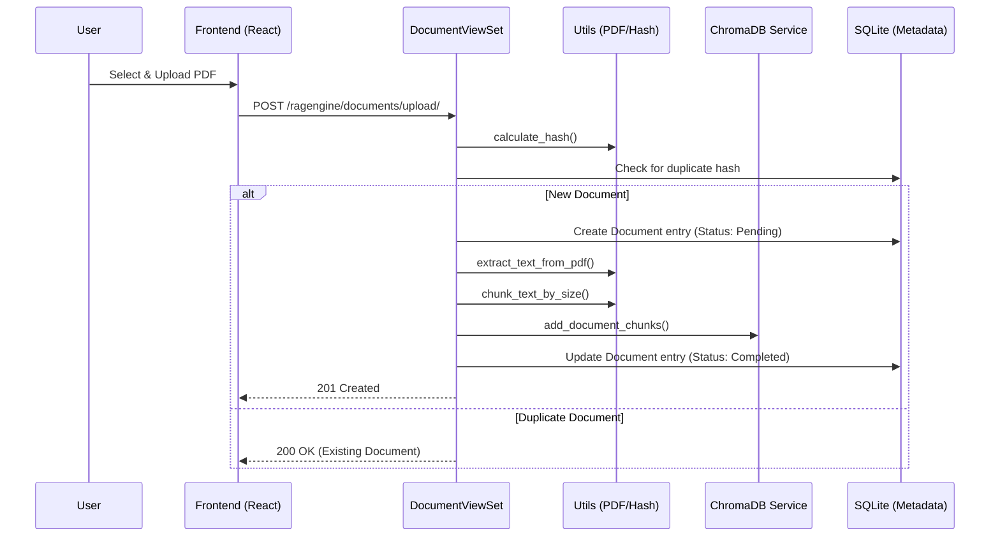
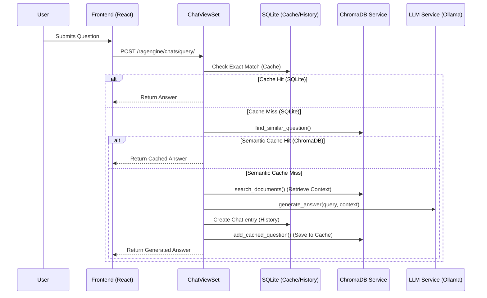

How to run RAGLite app
----------------
1. Clone the repository
2. Install dependencies
    * Backend:
      * install dependencies from requirements.txt  
      ```pipenv install -r requirements.txt```  
      > note: pipenv is used to install python packages here
    * Frontend:
      * run ```npm install``` 
3. download and run ollama services
    * downloand llama3.2, nemotron-3-nano, nemotron-mini, phi3:mini models  
       > ```ollama pull llama3.2```
    * run ollama as per the instructions in the ollama repo  
       > ```brew services start ollama```
4. Run the app as below
    * make sure ollama services are running
    * Backend: `python manage.py runserver 8001` (or any other port other than 8000 as ollama uses 8000 and 11434)
    * Frontend: `npm start`
        * Open ```[http://localhost:3000]``` to view it in your browser.


https://github.com/user-attachments/assets/a4d841b3-a38d-44e7-ac22-d962f422d1b7

# RAGLite Architecture

This document outlines the architecture and operation flows of the RAGLite application.

## 1. Overall System Architecture

The RAGLite application follows a modern decoupled architecture with a React frontend, a Django REST backend, and specialized services for Vector DB (ChromaDB) and LLM (Ollama) integration.



> [!NOTE]
> The **System Architecture** is largely identical to the Overall Architecture as the backend is a single service handling multiple responsibilities (metadata storage, service orchestration, and vector data management).

---

## 2. Operation Flows

### A. Upload Operation Flow
This flow describes how a document is processed from the moment a user uploads it.



### B. Query Operation Flow (RAG)
This flow describes the Retrieval-Augmented Generation process when a user asks a question.



<table>
  <td>Note: The bot image used is generated using Adobe Express. This project is a proof of concept and is not intended for production use.</td>
</table>
